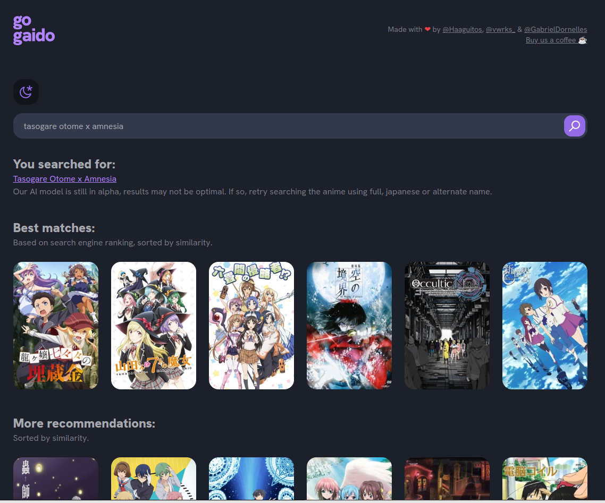

# anime_recommender
A Simple synopsis based anime recommender. Embeddings are projected with Bigbird-ROBERTA, kNN and SVM supported for recommendations.

We use a BERT model to perform name matching between the searched anime and the animes we have in the database.

## The simplest Frontend

This is a very simple frontend written by ChatGPT just to interact better with the API.


## We have a dedicated server and frontend!

We are using a free AWS machine to host part of this backend (until february 2024, when Amazon will start to charge for it 😔). Unfortunately, the free VM is very limited ([t2.micro](https://instances.vantage.sh/aws/ec2/t2.micro)), and it can't handle model inference, so the name matching BERT is disabled and a very simple algorithm is being used instead.

We do also have a dedicated frontend! See: https://gogaido.vercel.app/


## How to reproduce it

First, you should download [those files](https://drive.google.com/file/d/1-ddrmsloUfGAzJ8Ti4VBOhcnnT30Z4t0/view?usp=share_link) and place them under a directory named ```/data```, those are the already calculated embbedings for ~23k animes. 

Additionaly, you can [download this dataset](https://drive.google.com/file/d/1ZvRBJ9TvmHdbu-KZAxEwIkrE1gZq8Cog/view?usp=share_link) to populate the database, or run the embeddings yourself with a different model.

Then, create a MongoDB instance and populate it with:

```sh
# Install mongo: see https://www.mongodb.com/docs/mongodb-shell/install/
sudo service mongod start 
python3 misc/pickle_to_mongo.py
```

Now you should have a database that the API will use to retrieve data:


Then you can run the app with:

```sh
uvicorn app:app # or
gunicorn 0.0.0.0:8000 --daemon app:app -k uvicorn.workers.UvicornWorker # deploy it somewhere
```

Access ```http://127.0.0.1:8000/home```, frontend will be displayed on ```/home```.

